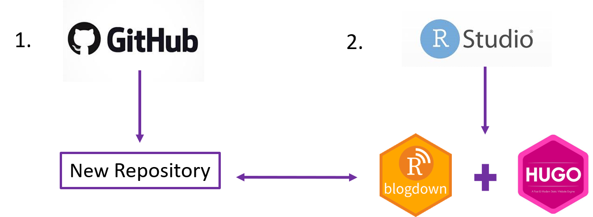
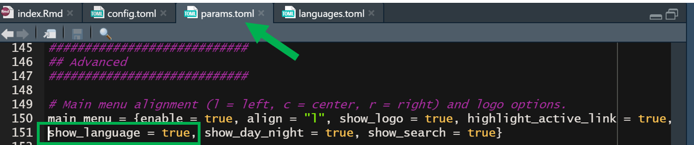
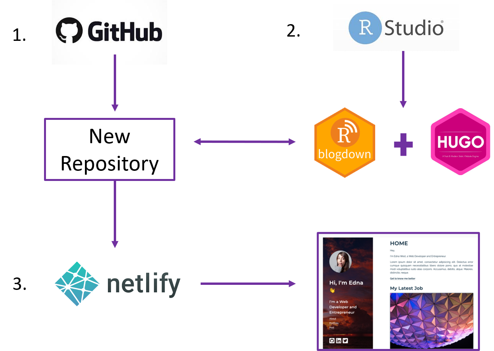
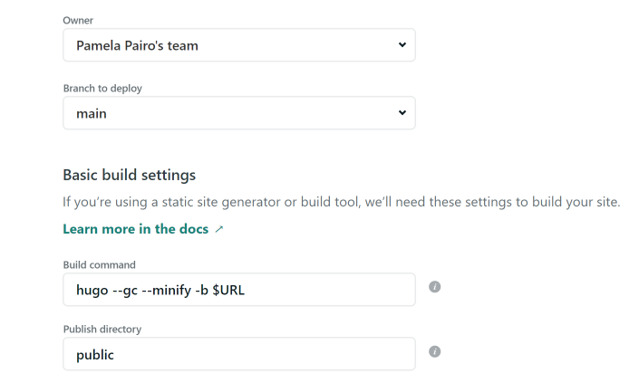
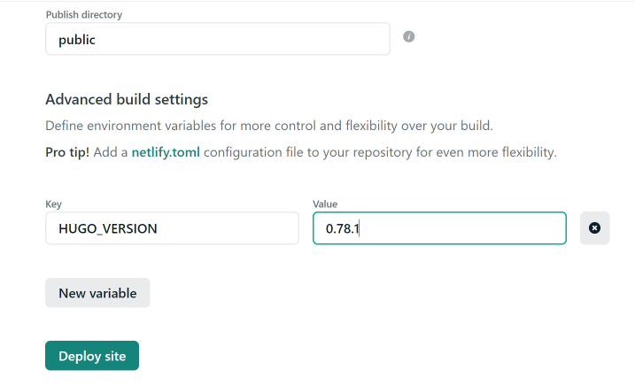

```{r setup, include = FALSE}
options(htmltools.dir.version = FALSE)
library(knitr)
library(tidyverse)
library(xaringanExtra)
# set default options
opts_chunk$set(echo=FALSE,
               collapse = TRUE,
               fig.width = 7.252,
               fig.height = 4,
               dpi = 300)
xaringanExtra::use_tile_view()
xaringanExtra::use_clipboard()
xaringanExtra::use_webcam()
xaringanExtra::use_broadcast()
xaringanExtra::use_share_again()
xaringanExtra::style_share_again(
  share_buttons = c("twitter", "linkedin", "pocket")
)

```

class: title-slide, center, top
background-image: url(images/frame.jpg)
background-size: cover

.right-column[
# `r rmarkdown::metadata$title`
### `r rmarkdown::metadata$subtitle`

**`r rmarkdown::metadata$author`**<br>
`r rmarkdown::metadata$date`
]

.palegrey[.left[.footnote[Graphic by [chanyutto chim](https://www.rawpixel.com/image/2431441/free-photo-image-wallpaper-abstract-texture)]]]

---
class: inverse, middle, center

# Why do you need a personal website?

<ion-icon name="checkmark-outline"></ion-icon>
---

# Some benefits

`r emo::ji("heavy_check_mark")`  Another way to practice your communication skills

--

`r emo::ji("heavy_check_mark")`  Exchange knowledge with colleagues and expansion of your networking

--

`r emo::ji("heavy_check_mark")`  The errors and doubts that arise and how to solve them can be useful for the rest of the community

--

`r emo::ji("heavy_check_mark")`  A platform to connect with the world.

---
background-image: url(images/language.jpg)
background-size: cover
class: center, middle, inverse

##.my-hot-DarkBlue[Overcoming]
##.my-hot-DarkBlue[language barriers with]
#.my-hot-DarkBlue[a multilingual website]

.palegrey[.left[.footnote[Graphic by [Hannah Wright](https://unsplash.com/s/photos/language?utm_source=unsplash&amp;utm_medium=referral&amp;utm_content=creditCopyText")]]]

---
background-image: url(images/laptop.jpg)
background-size: contain
class: center, top

#Let's do it!!

.palegrey[.left[.footnote[Graphic by [Sincerely Media](https://unsplash.com/@sincerelymedia?utm_source=unsplash&utm_medium=referral&utm_content=creditCopyText)]]]

---
# Building a website



---

# Blogdown + Hugo

```
├── config.toml            
`r emo::ji("folder")`── config/default
   ├── menus.toml     
   ├── params.toml    
   └── languages.toml
`r emo::ji("folder")`── content
`r emo::ji("folder")`── themes
```
+ _**params.toml**_: _theme_. Contact details (email, working address, twitter, GitHub, ResearchGate).

+ _**menus.toml**_: Navigation menu bar 

+ _**languages.toml**_: set up language/s

---

class: inverse, middle, center
# Making a bilingual website

---
##In _languages.toml_

``` code
[en]
  languageCode = "en-us"
  contentDir = "content/en"  # Uncomment for multi-lingual sites,and move English content into `en` sub-folder.
  title = "English site"
# Uncomment the lines below to configure your website in a second language.
[es]
 languageCode = "es"
 contentDir = "content/es"
  title = "Sitio en español"

  [es.params]
   description = "Sitio en español"
  [[es.menu.main]]
    name = "es"
    url = "#about"
    weight = 1
```
---
Rename _menus.toml_

```
`r emo::ji("folder")`── config/default
   ├── menus.es.toml     <- For spanish
   ├── menus.en.toml     <- For english
   ├── params.toml    
   └── language.toml    
```
--

Create one folder for each language

```
`r emo::ji("folder")`── content
   ├── `r emo::ji("folder")`- es     <- For spanish
   ├── `r emo::ji("folder")`- en     <- For english
    
```
---
## Choose the default language


In **config.toml**

For example, if we want that our page in spanish _defaultContentLanguage = “es"_

--

To show that the personal website is multilingual, check in _params.toml_ and verify that the _show_language= TRUE_



---

# Building a website

.center[]

---
class: inverse, middle, center

# Let's deploy the website!!

---
# Hugo version

Put _netlify.toml_ in the project's base folder. In this file we must specify the Hugo version used.

```{r, eval=TRUE, echo=TRUE}

blogdown::hugo_version()

```

And the _netlify.toml_ must be like this:

```{r, eval= FALSE, echo=TRUE}

[build.environment]
  HUGO_VERSION = "0.78.1" #Here is the hugo version
  HUGO_ENABLEGITINFO = "true"

```
---

#In Netlify

_New site from Git > GitHub_



---

#In Netlify

In _Show advanced_ write the Hugo version.



---
background-image: url(images/picture.jpg) 
background-size: cover
class: center, bottom, inverse

# Spread your website to the world!

.palegrey[.left[.footnote[Graphic by [Clem Onojeghuo](https://unsplash.com/@clemono)]]]

---
# Learn more:

+ [**blogdown: Creating Websites with R Markdown**](https://bookdown.org/yihui/blogdown/)  Yihui Xie, Amber Thomas, Alison Presmanes Hill

- [**The Download**](https://alison.netlify.app/larug-download/#1) by Alison Hill

- [**A Spoonful of Hugo: How much Hugo do I need to know?**](https://alison.rbind.io/post/2020-12-12-how-much-hugo/#you-want-to-customize-your-site) by Alison Hill

- [**¿Porqué necesitas tener una página web personal?**](https://pamepairo.netlify.app/post/7-12-2020-motivos-pagina-web/)

- Creando una página web bilingüe

---
class: goodbye-slide, inverse, middle, center

## Thank you!!  `r emo::ji("smile")`

.pull-left[


### Find me...

.center[ `r icon::fa("link")`
[pamepairo.netlify.app](https://pamepairo.netlify.app/)<br/>
`r icon::fa("twitter")`[pamepairo](https://twitter.com/PamePairo)<br/>
`r icon::fa("github")`[PamePairo](https://github.com/PamelaPairo)<br/>
]]